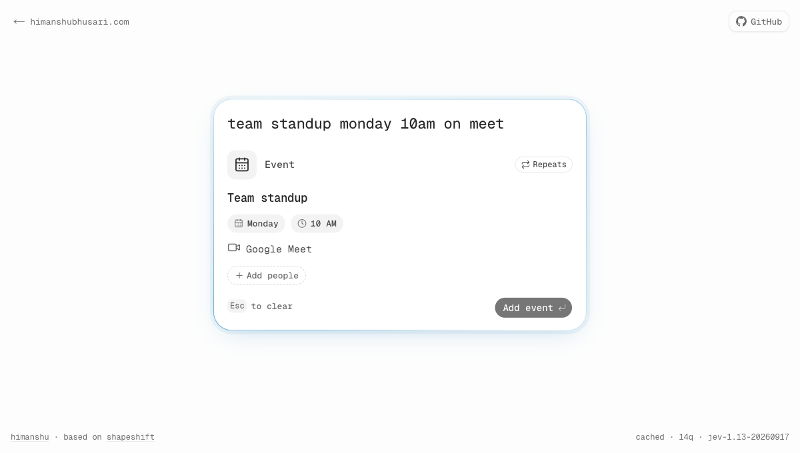
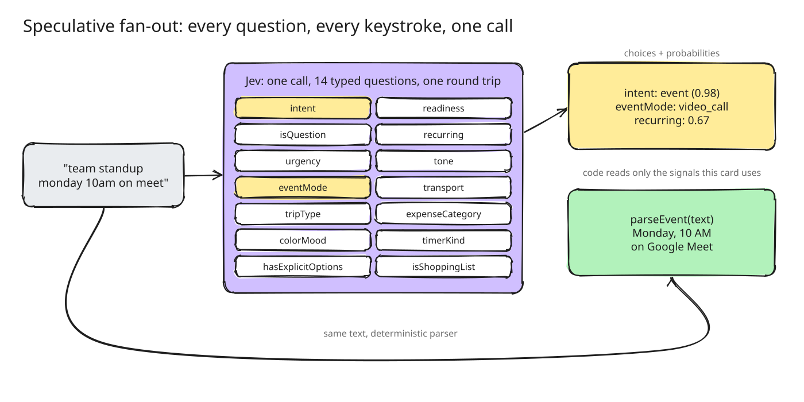

# Jev Playground

**A text box that becomes what you mean.** Type a sentence and watch it morph into the right card — an event, a checklist, a bill split, a timer, a color swatch — with every keystroke classified by [TypeSafe's Jev](https://openrouter.ai/~typesafe/jev-latest) model.

[](https://himanshubhusari.com/jevplayground/)
[](https://openrouter.ai/~typesafe/jev-latest)
[](https://nextjs.org)
[](https://workers.cloudflare.com)
[](LICENSE)

<p align="center"></p>

```
team standup monday 10am on meet  →  Event · Monday · 10 AM · Google Meet
buy coffee, batteries and limes   →  Shopping checklist
split $186 dinner between 4       →  $46.50 each
35000 feet in meters              →  10,668 m
```

## Jev decides, code computes

Jev isn't a chatbot. It's a classifier LLM: you hand it a piece of text plus a set of typed questions, and it returns calibrated probabilities — a yes/no (`noul`), a pick from options (`choice`), or a position on a scale (`score`).

One call to OpenRouter's Decisions API asks **14 questions in parallel**: *which card is this?*, *is it a video call?*, *how urgent is it?*, *is this a shopping list?* … Deterministic parsers then pull out the actual values — dates, amounts, units, math. The model never does arithmetic.

<p align="center"></p>

## Architecture

```
browser (GitHub Pages)  ──POST {text}──▶  Cloudflare Worker  ──▶  OpenRouter /api/alpha/decisions (Jev)
himanshubhusari.com/jevplayground          holds the API key        14 typed questions, one call
```

- **Static site** — Next.js `output: "export"`, served from GitHub Pages under `/jevplayground`.
- **Worker proxy** ([`worker/`](worker/src/index.js)) — keeps the OpenRouter key server-side, allows only known origins, rate-limits 30 req/min per IP, and edge-caches identical inputs.
- **Offline fallback** — if the Worker is down or rate-limited, a built-in keyword classifier takes over. The UI never flashes.
- **Calm UI** — a small state machine only switches cards when a challenger wins twice in a row, so raw model output doesn't flicker while you type.

## 19 card types

Event · Reminder · Checklist · Timer · Habit · Color · Split · Expense · Convert · Calculate · Trip · Poll · Contact · Bookmark · Countdown · Time zone · Random · Goal · Note

Press <kbd>/</kbd> to browse them all. <kbd>Enter</kbd> saves a card, <kbd>Esc</kbd> clears. Add `?debug=1` to see every probability.

## Run locally

Requires [Bun](https://bun.sh).

```bash
bun install
bun dev            # http://localhost:3000/jevplayground
bun run check      # typecheck + lint + 169 tests
bun run build      # static site in out/
```

Without `NEXT_PUBLIC_JEV_ENDPOINT` set, the app runs fully offline.

### Deploy your own Worker

```bash
cd worker
npx wrangler deploy
npx wrangler secret put OPENROUTER_API_KEY
```

Then point `NEXT_PUBLIC_JEV_ENDPOINT` at your Worker URL and add your site to `ALLOWED_ORIGINS` in `worker/wrangler.jsonc`.

## Credits

Built on [Shapeshift](https://github.com/anishfn/shapeshift) by anishfn (MIT) — ported from TypeSafe's SDK to OpenRouter's Decisions API, moved from a Next.js server route to a static export + Cloudflare Worker, and restyled.

---

<sub>Built by [Himanshu Bhusari](https://himanshubhusari.com)</sub>
